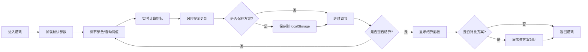

## 1. 产品概述

公益配餐调试模拟器是一款轻量级策略模拟游戏，玩家通过调节备餐数量、配送批次、志愿者分组和风险阈值等参数，优化公益配餐运营效率。游戏通过三级权限机制引导玩家理解运营数据，最终目标是在覆盖率、等待时长、浪费率和人力压力之间找到最佳平衡点。

## 2. 核心功能

### 2.1 权限等级
| 角色 | 核心权限 |
|------|----------|
| 玩家（运营者） | 调整所有参数、保存方案、对比方案 |
| 提示面板（观察者） | 仅查看风险变化提示 |
| 结算面板（审计者） | 仅查看最终得分和统计数据 |

### 2.2 功能模块
1. **参数调节面板**：备餐数量滑块、配送批次选择、志愿者分组配置、风险阈值拖动
2. **风险提示面板**：实时风险预警、阈值越线提醒、扣分规则说明
3. **结算面板**：综合得分、四项指标雷达图、历史记录
4. **方案对比模块**：多方案保存、指标横向对比、最优方案推荐
5. **数据持久化**：localStorage 存储配置方案

### 2.3 页面详情
| 页面名称 | 模块名称 | 功能描述 |
|-----------|-------------|---------------------|
| 主游戏页 | 参数调节区 | 四个核心参数滑块/选择器，阈值预警线可拖动 |
| 主游戏页 | 实时指标区 | 显示覆盖率、等待时长、浪费率、人力压力的实时数值 |
| 主游戏页 | 风险提示区 | 展示当前风险等级、越线项目、扣分详情 |
| 主游戏页 | 方案管理区 | 保存当前方案、加载历史方案、方案对比表格 |
| 结算弹窗 | 得分展示区 | 综合得分、四项指标得分、等级评定 |
| 结算弹窗 | 雷达图区 | 四维度能力雷达图可视化 |

## 3. 核心流程

## 4. 用户界面设计

### 4.1 设计风格
- **主色调**：温暖橙色系（#FF8C42）代表公益温暖，搭配深青色（#2A9D8F）作为安全色，红色（#E63946）作为风险警示色
- **按钮风格**：圆角 8px，微阴影，hover 时轻微上浮
- **字体**：标题使用 Noto Sans SC Bold，正文使用 Noto Sans SC Regular
- **布局风格**：卡片式三栏布局，左侧参数区、中间指标区、右侧风险提示区
- **图标风格**：线性图标，使用 lucide-react 图标库

### 4.2 页面设计概述
| 页面名称 | 模块名称 | UI 元素 |
|-----------|-------------|----------|
| 主游戏页 | 参数调节区 | 滑块组件、数字输入框、阈值拖动条、渐变色彩指示 |
| 主游戏页 | 实时指标区 | 四个数据卡片、进度条、数值动画过渡 |
| 主游戏页 | 风险提示区 | 风险等级徽章、警告列表、扣分说明 |
| 主游戏页 | 方案管理区 | 方案列表卡片、对比表格、保存/删除按钮 |
| 结算弹窗 | 得分展示区 | 大号数字得分、星级评定、指标分项得分 |
| 结算弹窗 | 雷达图区 | 四象限雷达图、渐变填充 |

### 4.3 响应式
- 桌面端（>1024px）：三栏并列布局
- 平板端（768-1024px）：上下两栏，参数区在上，指标和风险区并排在下
- 移动端（<768px）：单栏垂直布局，可折叠面板

### 4.4 交互细节
- 阈值拖动条：支持鼠标拖动，拖动时实时显示数值，越线时有红色闪烁提示
- 滑块调节：数值变化时有平滑过渡动画，关联指标同步更新
- 方案保存：成功时有 toast 提示，失败时有错误提示
- 风险预警：风险等级变化时有边框颜色渐变动画
