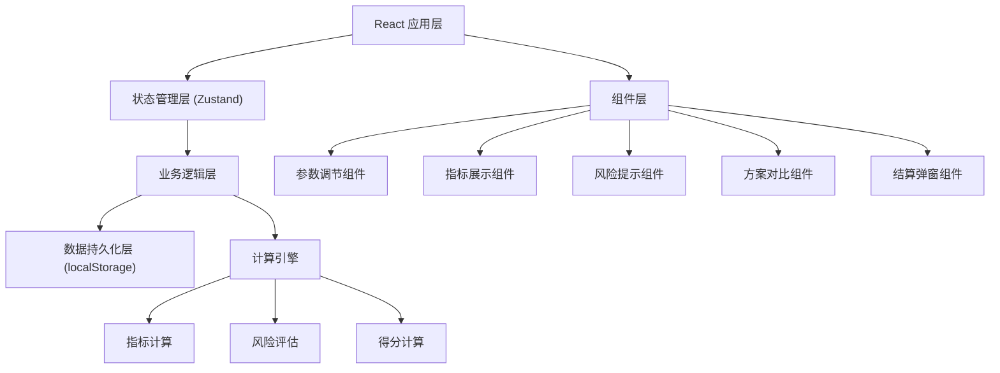

## 1. 架构设计



## 2. 技术描述
- **前端**: React@18 + TypeScript + Vite
- **样式**: TailwindCSS@3
- **状态管理**: Zustand
- **图标**: lucide-react
- **数据可视化**: 纯 SVG 实现雷达图（避免引入重型图表库）
- **数据持久化**: localStorage

## 3. 目录结构

```
src/
├── components/
│   ├── ParameterPanel/      # 参数调节面板
│   ├── MetricsPanel/        # 指标展示面板
│   ├── RiskPanel/           # 风险提示面板
│   ├── SolutionManager/     # 方案管理与对比
│   ├── SettlementModal/     # 结算弹窗
│   ├── ThresholdSlider/     # 阈值拖动滑块
│   └── RadarChart/          # 雷达图组件
├── hooks/
│   └── useLocalStorage.ts   # localStorage Hook
├── store/
│   └── gameStore.ts         # Zustand 游戏状态
├── utils/
│   ├── calculator.ts        # 指标计算引擎
│   └── constants.ts         # 常量配置
├── types/
│   └── index.ts             # TypeScript 类型定义
├── App.tsx
└── main.tsx
```

## 4. 数据模型

### 4.1 类型定义

```typescript
// 游戏参数
interface GameParams {
  mealCount: number;        // 备餐数量 (50-500)
  deliveryBatches: number;  // 配送批次 (1-8)
  volunteerGroups: number;  // 志愿者分组 (2-10)
  riskThreshold: number;    // 风险阈值 (0-100)
}

// 运营指标
interface Metrics {
  coverageRate: number;     // 覆盖率 (0-100)
  waitTime: number;         // 平均等待时长 (分钟)
  wasteRate: number;        // 浪费率 (0-100)
  workPressure: number;     // 人力压力 (0-100)
}

// 风险项
interface RiskItem {
  id: string;
  name: string;
  value: number;
  threshold: number;
  isOverThreshold: boolean;
  deduction: number;
}

// 方案
interface Solution {
  id: string;
  name: string;
  params: GameParams;
  metrics: Metrics;
  score: number;
  createdAt: number;
}

// 游戏状态
interface GameState {
  params: GameParams;
  metrics: Metrics;
  risks: RiskItem[];
  solutions: Solution[];
  currentScore: number;
  showSettlement: boolean;
}
```

### 4.2 localStorage 存储结构

```
Key: 'meal_delivery_solutions'
Value: Solution[] (JSON 序列化)

Key: 'meal_delivery_last_params'
Value: GameParams (JSON 序列化)
```

## 5. 核心计算规则

### 5.1 指标计算公式
- **覆盖率** = min(100, (备餐数量 / 需求基数) * 60 + 配送批次 * 5)
- **等待时长** = max(5, 60 - 配送批次 * 5 - 志愿者分组 * 2)
- **浪费率** = max(0, (备餐数量 - 200) * 0.15 + (8 - 配送批次) * 3)
- **人力压力** = max(0, 志愿者分组 * 8 + 配送批次 * 6 - 20)

### 5.2 风险判定规则
- 覆盖率 < 60% → 高风险，扣 15 分
- 等待时长 > 40 分钟 → 中风险，扣 10 分
- 浪费率 > 30% → 高风险，扣 15 分
- 人力压力 > 70 → 中风险，扣 10 分
- 综合风险值超过阈值 → 额外扣分

### 5.3 得分计算
- 基础分 = (覆盖率 * 0.3) + ((60 - 等待时长) * 0.25) + ((100 - 浪费率) * 0.25) + ((100 - 人力压力) * 0.2)
- 最终得分 = max(0, 基础分 - 风险扣分之和)
